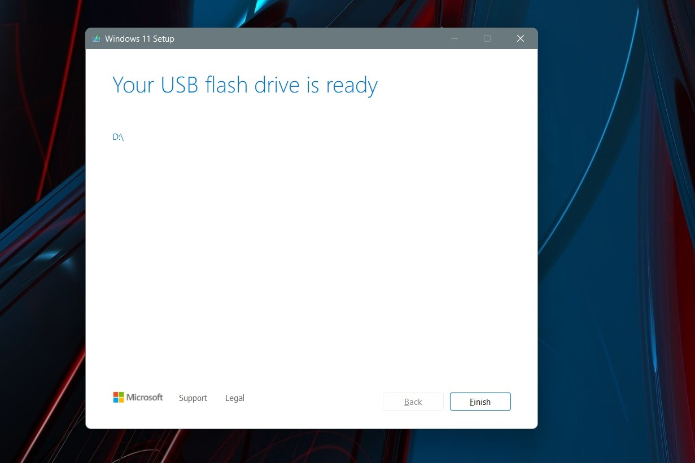

# Dev_Setup
Setup Development Environment

#Assignment: Setting Up Your Developer Environment

#Objective:
This assignment aims to familiarize you with the tools and configurations necessary to set up an efficient developer environment for software engineering projects. Completing this assignment will give you the skills required to set up a robust and productive workspace conducive to coding, debugging, version control, and collaboration.

#Tasks:

1. Select Your Operating System (OS):
   Choose an operating system that best suits your preferences and project requirements. Download and Install Windows 11. https://www.microsoft.com/software-download/windows11
   Step 1:
   Visit the windows download page and download and install Windows 11.
   .png)
   step 2:
   Download media creation tool for windowas and install it.
   Step 3:
   Agree to the terms and choose Accept. Let the Setup tool run, and choose Use the recommended options for this PC. Click Next, and choose USB flash drive
   Step 4:
   Choose your USB flash drive from the list and then click Next. You'll be prompted and Windows 11 will download to it. Once finished, the installer will switch to Creating Windows 11 Installation media. You'll know when it's finished, as you'll get a prompt that the drive is ready.

   
   Step 5:
   Once your USB drive is ready, close the installer with the Finish button. Keep the USB drive plugged into your PC
   Step 6:
   Head back to the Windows 10 settings app, and choose Update & security. Then choose Recovery on the left side. Under Advanced startup, choose the Restart now option.
   Step 7:
   Restart your PC.
   Step 8:
   Press F2 on the keyboard to open the Bios.
   Step 9:
   Press F6 on the keyboard to open the Advanced Settings.
   Step 10:
   Press F7 on the keyboard to open the Boot Options.
   Step 11:
   Press F8 on the keyboard to open the Boot Manager.
   Step 12:
   Choose boot from USB.
   Step 13:
   Wait for windows screen with install now button.
   Step 14:
   Choose custom install.
   Step 15:
   Click on the free space and then click on next.
   Step 16:
   Wait for windows to install and restart.
   Windows is successfully installed.

2. Install a Text Editor or Integrated Development Environment (IDE):
   Select and install a text editor or IDE suitable for your programming languages and workflow. Download and Install Visual Studio Code. https://code.visualstudio.com/Download
   Step 1:
   Visit the Visual Studio Code download page and download Visual Studio Code for Windows.
   .png)
   Step 2:
   When the download finishes, then the Visual Studio Code Icon appears in the downloads folder
   
   Step 4:
   Select and install Visual Studio Code.
   Step 5:
   Accept license agreement
   
   Step 6:
   Choose the location data for running the Visual Studio Code. It will then ask you to browse the location. Then click on the Next button.
   
   Step 7:
   Then it will ask to begin the installation setup. Click on the Install button
   
   Step 8:
   After clicking on Install, it will take about 1 minute to install the Visual Studio Code on your device.
   
   step 9:
   After the installation is done, it will open Visual Studio Code.
   

3. Set Up Version Control System:
   Install Git and configure it on your local machine. Create a GitHub account for hosting your repositories. Initialize a Git repository for your project and make your first commit. https://github.com
1. Download the executable Git file from git-scm.com/downloads.
2. Run the installation file with Administrator rights.
3. Choose an appropriate installation location such as C:\_tools\git.
4. Install the default components, including Git GUI Here and Git Bash Here.
5. Choose your preferred Git default editor. The default editor is Visual Studio Code. You can change it to any other text editor or IDE that you prefer.
6. Add Git to the Windows PATH.
7. Accept the default line ending conversion for Unix and Windows compatibility.
8. Chose the extra option to enable system caching.
9. Click Finish to complete the install.
10. Choose to open a Git Bash shell and start using Git!
11. Create a new repository on GitHub.
12. Add your project files to the repository.
13. Commit your changes.
14. Push your changes to GitHub.
The created github link is [here](https://github.com/Ketubo/repo001.git)

4. Install Necessary Programming Languages and Runtimes:
  Instal Python from http://wwww.python.org programming language required for your project and install their respective compilers, interpreters, or runtimes. Ensure you have the necessary tools to build and execute your code.
  Step 1: Download Python
   To start, go to python.org/downloads and then click on the button to download the latest version of Python.

   Step 2: Run the .exe file
   Next, run the .exe file that you just downloaded, and then follow the installation instructions.

   Note that you may check the box to add Python to the Path to facilitate future installation of Python packages.
   Step 3: Run a script in Python
   You can run a script in Python via the Python IDLE.

5. Install Package Managers:
   If applicable, install package managers like pip (Python).
   Step 1: Download pip
   Download the get-pip.py (https://bootstrap.pypa.io/get-pip.py) file and store it in the same directory as python is installed.

   Step 2: Run the get-pip.py file
   Run the get-pip.py file to install pip.

   Step 3: Run pip
   Run pip to install packages.

6. Configure a Database (MySQL):
   Download and install MySQL database. https://dev.mysql.com/downloads/windows/installer/5.7.html

   Step 1: Download MySQL server
   Download MySQL server from https://dev.mysql.com/downloads/windows/installer/5.7.html

   Step 2: Run the installer
   Run the installer.

   Step 3: Configure MySQL
   Configure MySQL.

   Note that you may check the box to add MySQL to the Path to facilitate future installation of MySQL packages.

   Step 4: Run MySQL
   Run MySQL.

7. Set Up Development Environments and Virtualization (Optional):
   Consider using virtualization tools like Docker or virtual machines to isolate project dependencies and ensure consistent environments across different machines.
   Step 1: Install Docker
   Download and install Docker from https://docs.docker.com/desktop/windows/install/.
   Step 2: Enable WSL
   Enable WSL by running the following command in PowerShell: Enable-WindowsOptionalFeature -Online -FeatureName Microsoft-Windows-Subsystem-Linux.

   Step 3: Run Docker
   Run Docker.

   Step 4: Run WSL
   Run WSL.

8. Explore Extensions and Plugins:
   Explore available extensions, plugins, and add-ons for your chosen text editor or IDE to enhance functionality, such as syntax highlighting, linting, code formatting, and version control integration.
   Step 1: Open Visual Studio Code
   Open Visual Studio Code.

   Step 2: Explore Extensions
   Explore Extensions.
   .png)
   Step 3: Explore Plugins
   Explore Plugins.

9. Document Your Setup:
    Create a comprehensive document outlining the steps you've taken to set up your developer environment. Include any configurations, customizations, or troubleshooting steps encountered during the process. 

#Deliverables:
- Document detailing the setup process with step-by-step instructions and screenshots where necessary.
- A GitHub repository containing a sample project initialized with Git and any necessary configuration files (e.g., .gitignore).
- A reflection on the challenges faced during setup and strategies employed to overcome them.

#Submission:
Submit your document and GitHub repository link through the designated platform or email to the instructor by the specified deadline.

#Evaluation Criteria:**
- Completeness and accuracy of setup documentation.
- Effectiveness of version control implementation.
- Appropriateness of tools selected for the project requirements.
- Clarity of reflection on challenges and solutions encountered.
- Adherence to submission guidelines and deadlines.

Note: Feel free to reach out for clarification or assistance with any aspect of the assignment.
